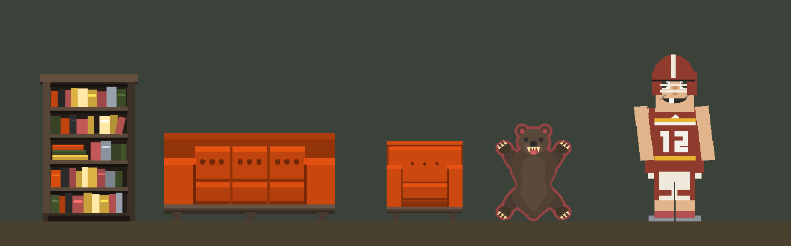
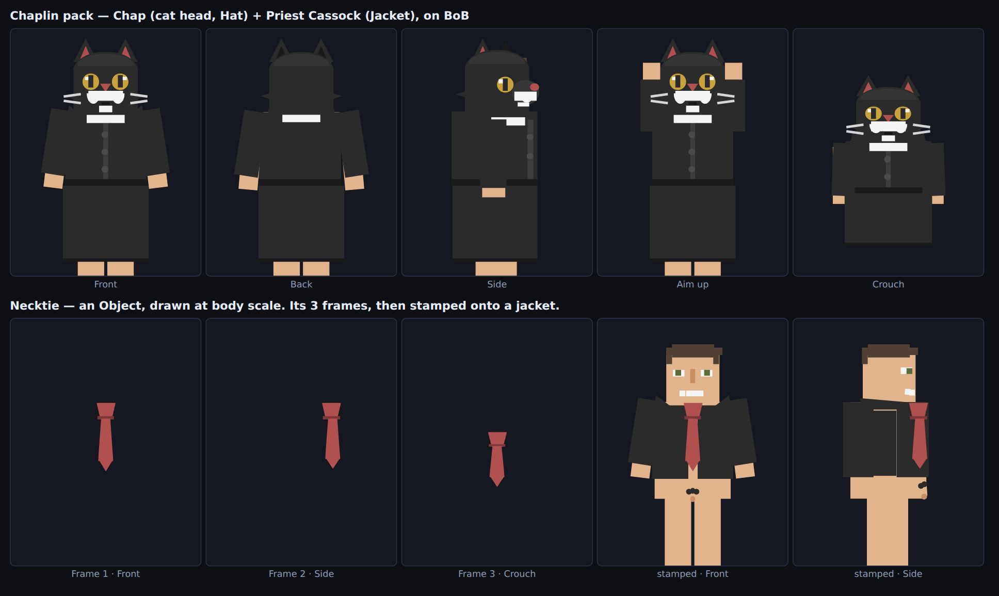

# Grenade pack

Six assets, built in the same 200×260 design canvas the app uses, in the same flat
two-tone style as the Fire prop and the army gear (`#3d4a28` olive, `#2b2b2b`,
`#8a929c` steel, `#b0504f`/`#ff7b00`/`#ffe8a8` for flame, `#504134` wood).

| Asset | Type | What it is |
| --- | --- | --- |
| **Explosion** | 🌿 Object / Prop | 5-frame boom: white-hot flash → fireball with spikes → ragged peak + flying debris → collapse into smoke → drifting smoke and embers. |
| **Crumbled Rock** | 🌿 Object / Prop | A pile of broken chunks with a little dust. One frame — nothing to animate. What the Rock leaves where it lands. |
| **Grenade Shell** | 🔮 Projectile | The grenade the launcher fires. Tumbling pineapple grenade, `size 0.9`. |
| **Grenade Launcher** | ⚔️ Weapon (Ranged) | Stubby break-action launcher — wood stock, olive tube, flared muzzle. Rest + Fire art (Fire has recoil and a muzzle flash) for Side / Aim-up / Crouch / Back. |
| **Grenade** | ⚔️ Weapon (Throwable) | The same grenade in Bob's hand, thrown with **G**. |
| **Rock** | ⚔️ Weapon (Throwable) | Grey lump. Barely hurts anything, never explodes. |

## They're wired to each other already

```
Grenade Launcher ──fires──▶ Grenade Shell (projectile)
        └──bursts into──▶ Explosion            (2.5-cell blast, boom art plays once)

Grenade (thrown with G) ──bursts into──▶ Explosion   (2-cell blast, 💥 Explode)
                        └──leaves──────▶ Fire        (your existing Fire prop, 2.5s burn)
Rock    (thrown with G) ──leaves──────▶ Crumbled Rock
```

The links are stored as asset ids (`gr3nsh1`, `expl0d3`, `r0ckrub`), so importing the whole
pack in one go keeps them connected. Import assets one at a time and you'll have to re-pick
them from the dropdowns in the weapon editor.

## Getting them into the app

**All six at once** — `grenade-pack.json` is in the same backup format as
`assetbuilder-backup-2026-07-25.json`:

1. Download `assets/grenade-pack.json` (Raw → save).
2. In the app: home screen → **Load** → **⬆ Open a file** → pick it.
3. It says *"Restored 6 asset(s) from the backup ✓"*.

This **merges** — it never wipes the library. Assets are keyed by id, so re-importing an
updated pack overwrites just these six and leaves everything else alone.

**One at a time** — open any of the single files (`explosion.json`, `grenade.json`, …)
with the same **⬆ Open a file** button; it loads straight into the editor, then hit Save.

## How an explosion gets drawn (this changed in the app itself)

Throwables can now explode. **💥 Explode** used to be a Ranged-only setting; it's on the
Throwable panel too, so a grenade bursts where it lands — the same one-shot boom a shot makes
(frames played through once, then gone), plus splash damage in the blast radius.

That matters because the *other* way to get an explosion out of a throwable — pointing its
**Fire look** at an explosion Object — is ground art, and ground art used to loop forever.
Two fixes went in with this pack:

- A grenade's landing art now plays its frames through **once** across the burn and clears when
  the burn ends. Before, it looped at the Object's own `animFps` until you pressed Stop, so an
  explosion picked as the "Fire look" kept re-detonating on the ground.
- A shot that hits **nothing** now detonates when its fuse runs out instead of silently
  vanishing, so firing the launcher across open ground actually shows the boom.

So in this pack: the Explosion is the **boom art** on both the launcher and the grenade
(`explodePropId`), and the **Fire look** is the stuff that's meant to sit on the ground
afterwards — your existing 🌿 Fire for the Grenade, 🌿 Crumbled Rock for the Rock.

## Numbers they were given (all tweakable in the editor)

- **Grenade Launcher** — 16 damage, 2.5-cell blast, fire rate 1/sec, clip 4, 2.2s reload,
  projectile speed 11, 0.5s stun, boom size 4 cells for 0.8s. Categories: `T2 / Launcher / Rare`.
  The 🔴 muzzle marker sits at the mouth of the barrel in every pose, so shots leave the tube.
- **Grenade** — weight 3 (≈7 blocks at Strength 5), 💥 2-cell blast for 12 damage, then burns
  14 HP/sec for 2.5s over a 3×3 splash. Categories: `T1 / Grenade / Common`.
- **Rock** — weight 6 (≈5 blocks, drops short), 2 HP/sec for 1s, single cell, no explosion.
  Categories: `T1 / Rock / Common`.

Both throwables and the launcher ship with pre-built fits for **BoB** and **Bobbett**
(plus the default guide body), so they sit in the right hand on either body without refitting.

---

# Trailer park pack (1960s)

Six more props, same flat two-tone style, sized against Bob — he renders 7 cells tall,
so one level cell is roughly 10 inches and everything here is built to that ruler.

| Asset | Size | What it is |
| --- | --- | --- |
| **Dinette Chair** | 4 | Chrome tube frame, harvest-gold vinyl pad with piping and tuft buttons. Side-on. Stands ~34in — hip height on Bob, which is what a chair does. |
| **Kitchen Cabinet** | 9 | Wall cabinet, speckled formica counter with a chrome edge, tiled backsplash, base cabinet with drawers. Floor-to-ceiling, ~7ft. |
| **Trailer Hitch End** | 12 | Rounded front cap, A-frame tongue, propane bottle, TV aerial, rust weeping down the seams. |
| **Trailer Mid Section** | 12 | Two jalousie windows and a roof vent. |
| **Trailer Mid — AC Wall** | 12 | No windows: a window-shaker air conditioner, the electric meter and a patched seam. Alternate it with the windowed mid so a long trailer doesn't read like a train carriage. |
| **Trailer Door End** | 12 | Rounded rear cap, screen door under a striped awning, porch light, block steps. |

## Why the trailer is a kit and not one prop

A prop is drawn in an N-cell square with the whole 200×260 canvas fitted inside it, so
its widest is `(200/260) × 12 = 9.2 cells` — and a mobile home stood about 8ft (8 cells,
taller than Bob) and ran 40–60ft long. Correct height and correct length can't both fit
in one square. So it's a kit instead:

```
[Hitch End] [Mid] [AC Wall] [Mid] … [Door End]
```

**Place every piece at size 12, anchored on the same row, 9 cells apart.** The body,
belt line, siding seams and skirting are drawn to identical heights and run to both
canvas edges, so the sections butt together with no seam — the ~7px overlap that 9-cell
spacing leaves is what hides it. Add as many mids as you want; two ends and two mids
gives a 36-cell single-wide.

The pieces are drawn with the skirting bottom at the very bottom of the canvas, so
anchor them **11 cells above your ground row**. Same idea for the furniture: the chair
anchors 4 cells above the floor, the cabinet 8.

## Import

`trailer-park-pack.json`, same as before: home screen → **Load** → **⬆ Open a file**.
Six assets, merged by id, nothing else touched.

---

# Living room pack (1960s)

Four more props for the inside of the trailer, same flat two-tone style and the same ruler
as the trailer park pack — Bob renders 7 cells tall, so one level cell is about 10 inches.



| Asset | Size | What it is |
| --- | --- | --- |
| **Bear Skin Rug** | 4 | The hide seen from above — head at the far end, jaws open, four legs splayed, claws out, on a dusty-red felt backing. Floor art, drawn the way the 1960s Carpet is. |
| **Bookshelf** | 6 | Five-bay walnut case, ~5ft tall. Loaded with book spines, one shelf with a flat stack, one book leaning into a gap. |
| **1960s Couch** | 9 | The big one. Three-seater, ~5'9" long, back 36in — as long as Bob is tall, and about half his height. Burnt-orange upholstery on a walnut plinth with splayed tapered legs. |
| **1960s Armchair** | 4 | The one-person kind — *armchair*. Same fabric, same plinth, same legs as the couch, so they read as a set. ~31in wide, 33in to the top of the back. |

## Colours

Nothing new was invented. The upholstery is `#c1440e`, the same burnt orange as the 1960s
Carpet; the wood is `#504134`; the rug's felt backing is `#b0504f` with `#2b2b2b` for the
nose and eyes and `#ffe8a8` for the teeth and claws. Only the book spines reach any wider,
and they borrow `#3d4a28`, `#c8a23c` and `#8a929c` from the army gear.

Every piece is fully opaque. Where something needed to look lit or shadowed it's a hard-edged
strip of the *same* colour at a different `bright` — the way the Fire prop and the Bush are
built — not a translucent overlay. The couch is two hex colours in total, the armchair two,
the rug four.

## Placing them

The three pieces of furniture are drawn with the bottom of the art on the bottom of the
canvas, so **anchor each one its own size in cells above your ground row** — the bookshelf 6,
the couch 9, the armchair 4. Then they stand on the floor with nothing to nudge.

The rug is the odd one out: like the 1960s Carpet, it's floor art seen from above rather than
a thing with a height, so the 10-inch ruler doesn't really apply to it. Size 4 puts it at
about the width of the armchair; take it up to 6 if you want it to fill the floor in front of
the couch. It defaults to **not solid** — the other three default to solid, so Bob can stand
on the couch.

## Sub-categories

Objects now carry a **sub-category** — one free-text group you type in the Object editor, under
Object settings. It's only a filing label: nothing in the game reads it, and an Object without
one files under **Unknown** rather than disappearing from any list.

Where it shows up:

- **Level Creator / Room Creator** → Objects layer → 🌿 Object. You get a sub-category dropdown
  first, then the Object list narrowed to it. The dropdown only appears once there's more than
  one group, so a small library doesn't grow a step it doesn't need.
- **📂 Load → Objects / Props** drills down the same way, the way Clothes & Armor drills down
  by slot.

Spelling is matched trimmed and case-insensitively, so `interior`, `Interior` and `Interior `
are one group; the label shown is whichever spelling that group's first Object used. Named
groups sort A→Z and **Unknown** is always last, so untagged Objects never push the tidy ones
down the list.

Everything in `assets/` ships tagged:

| Sub-category | Objects |
| --- | --- |
| **Interior** | Bear Skin Rug, Bookshelf, 1960s Couch, 1960s Armchair, Dinette Chair, Kitchen Cabinet |
| **Trailer Park** | Trailer Hitch End, Trailer Mid Section, Trailer Mid — AC Wall, Trailer Door End |
| **Effects** | Explosion, Crumbled Rock |

Re-importing any of the packs is what applies these to Objects already in your library — they're
merged by id, so it overwrites just those and leaves everything else alone.

## Import

`living-room-pack.json`, same as the other packs: home screen → **Load** → **⬆ Open a file**.
Four assets, merged by id, nothing else touched. Or open `bear-skin-rug.json`, `bookshelf.json`,
`couch.json` or `armchair.json` one at a time with the same button.

---

# Chaplin pack — Chap the cat head, priest robes, and a tie

Three assets for the Chaplin character: a tuxedo-cat head that wears as a **Hat**, black
priest's robes that wear as a **Jacket**, and a **necktie** built as an Object purely so it
can be stored as a group and stamped into other garments.



| Asset | Type | What it is |
| --- | --- | --- |
| **Chap — Cat Head** | 🎩 Hat | A tuxedo cat's head, big enough to wear as a mascot head. Black, gold eyes with slit pupils, dusty-rose nose and inner ears, and the white muzzle drawn as a **moustache** — a bar under the nose with a whisker-pad lobe on each side. Defence 1, +1 Agility. |
| **Priest Cassock** | 🧥 Jacket | Floor-length black cassock, closed up the front with a lifted placket and three buttons, a dark cincture at the waist, and a white Roman collar. Defence 2, +1 Intelligence. |
| **Necktie** | 🌿 Object / Prop | Not really an Object — a delivery vehicle. Three frames (Front / Side / Crouch), each drawn at the exact coordinates the tie needs on BoB's chest. Sub-category **Clothing Parts** so it's easy to find and easy to delete. |

## "Is there a checkmark to hide the hair under a hat?"

Yes, and it works — but the checkbox is on the **skin**, not on the hat.

- Open the skin, click a hair block, and tick **Hide if hat** *(e.g. top of the hair)* in the
  block panel. Do it **per block, per pose** — each pose is its own drawing.
- Any Hat-slot item then hides those blocks outright while it's worn. Nothing to set on the
  hat itself.
- The hat can opt **out**: the Hat editor has a **🚫 Ignore "Hide if hat"** card —
  *"This hat doesn't hide 'Hide if hat' pieces"* — which is there for glasses and the like.
  **Chap leaves it off**, which is what you want.

One thing to fix on your side: in the copy of **Bob Skin** that's in this repo, the hair is
flagged in Front, Back and Crouch but **not in Side** — all three side hair blocks are
unflagged. So in profile a wedge of brown hair pokes out over the back of the cat's head.
Tick those three and the profile goes clean. (If your current skin already has them flagged,
ignore this — nothing else needs changing.)

Independently of the flag, the cat head is drawn to swallow BoB's head box whole in every
pose: his head is `x72–128` at `y34–90` (`y70–120` crouched), and the skull is a flat-bottomed
block at `x66–134` running to the bottom of that box, domed on top. So it covers his face
without relying on the flag at all — the flag is only about hair that sticks out past his head.

## What the robes were built from

Not from "Bobs Robes" — from the **Leather Jacket's** BoB fit, which is the one whose
shoulders, sleeves and crouch layout already sit right. Kept verbatim: the `tri2` shoulder
slopes, the sleeve angles (81° front/back, 90° side, 88° crouch), and the crouch sleeve. Changed:

- The two front panels with a gap between them became one closed panel — a cassock buttons up,
  it doesn't hang open over a shirt.
- The body runs on past the waist to a hem at `y245`, just above the shoes. One straight fall,
  not a widening skirt — a tiered hem reads as a dress.
- The crouch skirt and hem are flagged **Over arms**. Plain jacket panels get tucked behind the
  bent knee in Crouch (correct for a coat, so the knee comes through); a robe should drape over
  the knee instead, and `overArms` is what keeps it in front.
- Sleeves end at the wrist, so the hands show — same as every other jacket in the library.

## The tie, and how to get it out of the Object editor

The tie is drawn **at body scale, in body coordinates** — the knot at `y89`, the point at
`y161`, centred on `x100`. That matters: **📦 Store group** copies blocks at their exact
coordinates and **places them back at those same coordinates**. So a stored tie dropped into a
shirt or jacket lands on the chest already positioned; there's nothing to drag.

The Object editor draws no guide body (Objects don't get one), so in there the tie looks like
it's floating in an empty canvas. That's right — it's sitting where BoB's chest would be.

Because Objects only ever use the Front pose, the three poses are kept as **frames** instead:

| 🎞 Frame | Pose it's drawn for |
| --- | --- |
| **1** | Front — and Aim up, which uses the same torso box |
| **2** | Side — shifted to the front edge of the chest, narrower |
| **3** | Crouch — shorter blade, and 30px further down the canvas, where the crouched torso is |

So the run is:

1. Open **Necktie**, pick **🎞 Frame 1**.
2. Select all four blocks, type a name, **📦 Store group**.
3. Repeat for frames 2 and 3 under different names (e.g. `Tie F`, `Tie S`, `Tie C`).
4. Open the suit jacket (or the button-up) and, in each pose, click the matching
   **📦 Stored:** button. Front and Aim up both take `Tie F`; Back gets nothing — a tie isn't
   visible from behind.
5. Delete the Necktie Object once every copy is placed. The stored groups outlive it — they
   live in the stamp store, not in the Object.

Saves are keyed by **id**, so saving in step 4 updates the jacket you already have rather than
making a second one. To end up with both a plain jacket and a tie'd variant, fork it first:
**💾 Save & Open** on the plain jacket, then in that dialog's textarea change the `"id"` to
something new, rename it above, hit **Load this text** and **💾 Save**. You're now editing the
copy, and the original is untouched.

The tie is flat `#b0504f` with one hard line under the knot, and nothing else. To recolour it,
click a block, pick a shade with **Replace everywhere** on and the whole tie follows.

## Fits

Both garments ship with the **BoB** fit (`telfv37`) and the same art under Default, so they
work on the guide body too. There's no Bobbett fit: her front and side head boxes are 44 wide
and centred on `x96`, while mirrored blocks always reflect about `x100`, so a cat head fitted
to her can't be built out of mirrored pairs the way this one is. If you want her in it, open
the asset, switch the guide to Bobbett and hit **📋 Copy to other characters**, then nudge the
ears in — it's a two-minute job by hand and a wrong-by-4px job automatically.

## Colours

Nothing new: `#2b2b2b` for the fur and the cassock, `#f4f4f4` for the tuxedo markings and the
collar, `#b0504f` for the nose, inner ears and the tie, `#c8a23c` for the eyes. Every lighter
or darker shade is the *same* hex at a different `bright` — the crown at `1.22`, the muzzle in
profile at `1.25`, the placket at `1.4`, the buttons at `1.75`, the cincture at `0.62` — so the
whole pack is four colours.

## Import

`chaplin-pack.json`, same as the other packs: home screen → **Load** → **⬆ Open a file**.
Three assets, merged by id, nothing else touched. Or open `chap-cat-head.json`,
`priest-cassock.json` or `necktie.json` one at a time with the same button.
